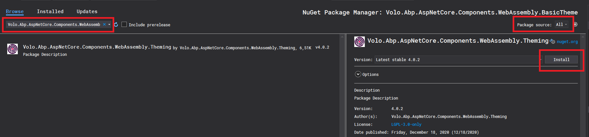

# Creating a new UI theme by copying the Basic Theme (for Blazor)

In this article, we will create a new UI theme by copying the Basic Theme and make some changes to it.
We have used a very similar approach previously for MVC UI [here](https://community.abp.io/articles/creating-a-new-ui-theme-by-copying-the-basic-theme-for-mvc-ui-yt9b18io).

This time we will make our own copy of Basic Theme for Blazor.

## In brief, the steps are: 
 * Create a new solution with Blazor UI
 * Copy the `.BasicTheme` project into the solution from the Github repo
 * Remove the Basic Theme nuget package in the `.Blazor` project
 * Build `.BasicTheme` project and fix errors
 * Reference the newly added local `.BasicTheme` project in the `.Blazor` project
 * Make some changes in `.BasicTheme` project to see it in action 

Let's get into the details step by step.

##  Create a new solution with Blazor UI

Use the `new` command of the ABP CLI to create a new project:

````shell
abp new CustomBlazorTheme -blazor
````
In case if you don't have ABP CLI installed on your environment, you can install or update it using the following commands.
````shell
dotnet tool install -g Volo.Abp.Cli
dotnet tool update -g Volo.Abp.Cli
````

Now open the created solution in Visual Studio.

We need to apply migrations to create the database. 

To apply database migrations right-click to the `.DbMigrator` project and select **Set as StartUp Project**

Hit F5 to run the application.

When the database migrations successfully completed, close the debug console window.

Now right-click to the `.HttpApi.Host` project and click on **Debug>Start New Instance**.
This opens the browser with the Swagger UI. 
Then right-click to the `.Blazor` project and click on **Debug>Start New Instance** to run also the client site of our project.

When you run the application, the index page will show up in your browser as seen below.

 
 ##  Copy the `.BasicTheme` project into the solution from the Github repo
 To create a new theme, copy the [WebAssembly BasicTheme Source Code](https://github.com/abpframework/abp/tree/dev/framework/src/Volo.Abp.AspNetCore.Components.WebAssembly.BasicTheme) into your `src` folder. 
  
  Once you get a copy of the theme in your solution, right-click on the `src` folder and select Add > Existing Project.
  
  
  In the file dialog select the `Volo.Abp.AspNetCore.Components.WebAssembly.BasicTheme.csproj` file and click Open button to add the project to your solution.
  
  
  ##  Remove the Basic Theme nuget package in the `.Blazor` project
To remove the `Volo.Abp.AspNetCore.Components.WebAssembly.BasicTheme` NuGet package in your `.Blazor` project right-click on your `.Blazor` project and click on `Manage Nuget Packages...`

Then click Uninstall.

  

  ##  Build `.BasicTheme` project and fix errors

When you build the `.BasicTheme` Project you will get some errors.

First, open the `Volo.Abp.AspNetCore.Components.WebAssembly.BasicTheme.csproj` file and delete the 3 rows as seen in the image below
 because these project references are not valid anymore.
 
  

Then, right-click on your `.BasicTheme` project and click on `Manage Nuget Packages...`

  On the `Browse` tab, search for `Volo.Abp.AspNetCore.Components.WebAssembly.Theming` and install it.
  
  
  
At the time of writing this article, this fixes the errors, but if you face other reference issues simply search for that package and install it.

Now build the `.BasicTheme` Project again and see if everything is ok.

##  Reference the newly added local `.BasicTheme` project in the `.Blazor` project

We will add a reference for the newly added `.BasicTheme` project in the `.Blazor` project.

For this right-click to Dependencies on your `.Blazor` project and click on `Add Project Reference`

  
  
  In the opened window, select `.BasicTheme` project and click Ok.
  
  
  
 ## Make some changes in `.BasicTheme` project to see it in action 
  
 Time to make some changes.

  Let's make a tiny change for the `Log In` text which is located at the main navbar.
  
To achieve this open the `LoginDisplay.razor` file located at /Themes/Basic/ folder. 
And add `for more` after `Log In` text.
  
  

Now right-click to the `.HttpApi.Host` project and click on **Debug>Start New Instance**.
Then right-click to the `.Blazor` project and click on **Debug>Start New Instance** to run also the client site of our project..

:tada: And Voila! here is the result.
  
  Now, we have our own copy of the Basic Theme and can do whatever we want.
  
  
  
  From now on it is up to your imagination.  
  You can modify the theme in your own copy of it. 

Find more about ABP Blazor UI [here](https://docs.abp.io/en/abp/latest/UI/Blazor/Overall).
 
Get the source code on [GitHub](https://github.com/ebubekirdinc/CustomBlazorTheme). 

Enjoy and have fun!
